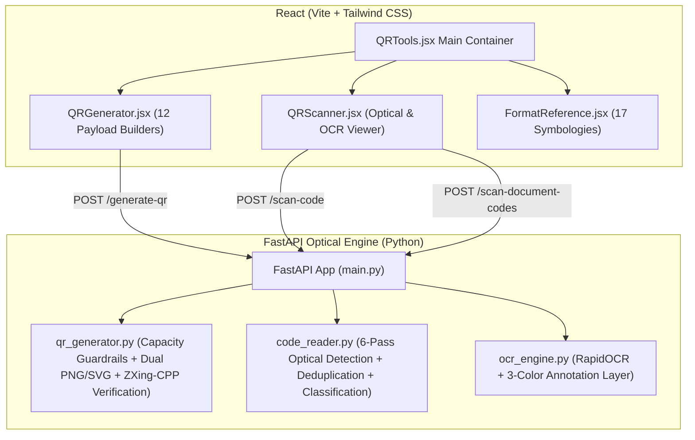

# QR & Barcode Optical Suite 🚀

A production-grade, standalone web application and optical intelligence suite featuring a high-performance **Python (FastAPI + OpenCV + ZXing-CPP + RapidOCR)** backend and a responsive **React (Vite + Tailwind CSS)** frontend.

---

## Architecture Overview



---

## Key Features

### 1. QR Code Generator (`backend/qr_generator.py`)
- **12 Standardized Payload Builders**:
  1. Plain Text
  2. Website URL (`https://...` auto-formatting)
  3. Phone Number (`tel:+...`)
  4. Email Address (`mailto:...` or `MATMSG:...`)
  5. SMS Message (`SMSTO:number:body`)
  6. Wi-Fi Network (`WIFI:T:WPA;S:ssid;P:password;;`)
  7. Digital Contact / vCard (`BEGIN:VCARD...VERSION:3.0`)
  8. GPS Geolocation (`geo:lat,lng?q=label`)
  9. Product Barcode / SKU payload (`SKU: <code> | NAME: <name> | GTIN: <gtin>`)
  10. Order ID payload (`ORDER#<id> | AMT: <amount> | CUST: <customer>`)
  11. Shipping / Waybill payload (`AWB: <awb> | CARRIER: <carrier> | ROUTE: ...`)
  12. JSON Structured Data (with auto-formatting and validator)
- **Error Correction Levels**: L (7%), M (15%), Q (25%), H (30%)
- **Data Capacity Guardrail**: Rejects payloads exceeding the ~2.9 KB QR limit with live percentage meter.
- **Dual Format Rendering**: Base64 PNG data URL + pure vector SVG markup.
- **Automated Self-Verification**: Decodes generated QR codes using `zxing-cpp` before returning to guarantee 100% optical readability.

### 2. Multi-Pass Optical Scanner (`backend/code_reader.py`)
- **Supported 1D & 2D Symbologies**:
  - **2D**: QR Code, Data Matrix, Aztec, Micro QR, MaxiCode, RMQR.
  - **1D**: Code 128, Code 39, Code 93, EAN-13, EAN-8, UPC-A, UPC-E, ITF-14, Codabar, GS1 DataBar, PDF417.
- **6 Progressive Detection Passes**:
  1. **Pass 1**: Native full-resolution image scan via `zxingcpp.read_barcodes`.
  2. **Pass 2**: Multi-scale upscaling ($1.5\times, 2.0\times$) for high-frequency linear bars.
  3. **Pass 3**: Regional band cropping (Top 60% and Bottom 60% tracking bands).
  4. **Pass 4**: Grayscale + CLAHE contrast enhancement + Otsu & Adaptive Gaussian thresholding.
  5. **Pass 5**: Multi-angle rotations ($90^\circ, 180^\circ, 270^\circ$) with inverse coordinate mapping.
  6. **Pass 6**: `cv2.QRCodeDetector` / `QRCodeDetectorMulti` fallback.
- **Spatial Bounding Polygon Tracking**: Exact coordinates mapped back to original image dimensions with IoU deduplication.
- **Payload Classification**: Intelligent classification into `Tracking URL`, `AWB Number`, `Order ID`, `Shipment ID`, `Courier Information`, `Wi-Fi Config`, `Digital Contact`, `Geolocation`, `Phone Number`, `Email Address`, `JSON`, and `Product SKU`.

### 3. Visual Bounding Box Overlay & Document OCR (`backend/ocr_engine.py`)
- **RapidOCR Text Extraction**: Fast ONNX-runtime document OCR.
- **3-Color Visual Annotation Map**:
  - 🟢 **Green boxes**: OCR text words/lines (>75% confidence) with confidence tags.
  - 🟣 **Purple/Violet polygons**: 2D QR & Data Matrix codes with `[QR: <Format>]` badges.
  - 🟠 **Orange/Azure polygons**: 1D linear barcodes with `[1D: <Format>]` value badges.

---

## Quick Start Guide

### 1. Start Backend (FastAPI)
```powershell
# From the project root directory
python -m uvicorn backend.main:app --host 127.0.0.1 --port 8000 --reload
```
API Documentation will be available at: [http://127.0.0.1:8000/docs](http://127.0.0.1:8000/docs)

### 2. Start Frontend (React + Vite)
```powershell
cd frontend
npm run dev
```
Web application will be accessible at: [http://localhost:3000](http://localhost:3000)

---

## API Endpoints

| Method | Path | Description |
| :--- | :--- | :--- |
| `GET` | `/health` | Health check & engine status |
| `GET` | `/formats` | Reference metadata for 17 optical symbologies |
| `POST` | `/generate-qr` | Generate QR code with payload builder & self-verification |
| `POST` | `/scan-code` | Fast multi-pass optical barcode & QR scanner |
| `POST` | `/scan-document-codes` | Combined Document OCR + Barcode/QR detection with 3-color visual overlay |
